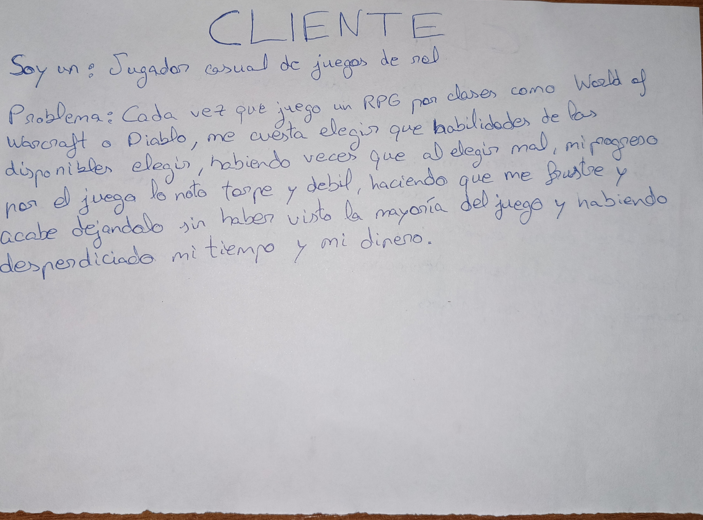

# OptimaBuild
## Cliente
Un jugador habitual de videojuegos de rol por clase con tiempo o conocimientos limitados

## Descipcion del problema
Muchos jugadores de juegos de rol inician una partida con una clase en mente, pero cuando llega el momento de subir de nivel y elegir una habilidad de las que hay, la cosa se complica: que si esta es buena, que si la otra es mejor pero en casos concretos, que si esta me da beneficios instantaneos... , un comedero de cabeza en general.

La mayor frustracion y el principal problema es que la mayoria de los jugadores no tienen tiempo suficiente para estar todo el dia probando clases y habilidades y esto puede desencadenar en la eleccion de una serie de talentos que terminan haciendo del juego un sufrimiento en el que no puedes avanzar, optando al final por dejar de jugarlo o reiniciar otra partida y haber perdido todo el tiempo y a veces incluso el dinero de comprar el juego.

Teniendo en cuenta que un jugador promedio puede tener de 7 a 10 horas semanales de juego y no se da cuenta del bloqueo hasta las 20-30 horas, este jugador habria perdido un total de 3 semanas. Es por eso que este problema es real y lo he experimentado de primera mano mas de una vez.

## Logica de negocio
El problema radica en la necesidad de determinar con antelación si una ruta de puntos de habilidad es viable para una clase en concreto, calculando y evaluando secuencias de progresión que maximicen el rendimiento del personaje según el presupuesto de niveles disponible sin atravesar valles críticos de debilidad que desemboquen en un bloqueo.

## Documentación adicional
La configuración establecida para este objetivo se encuentra en este [enlace](./docs/configuracion.md)